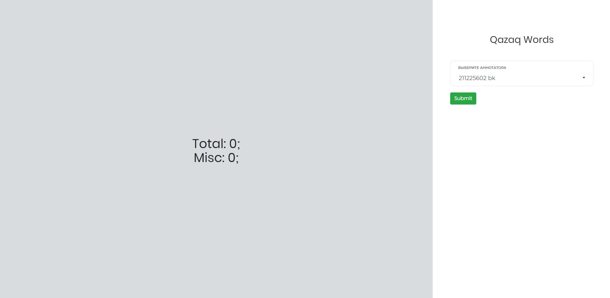

# norlist-bbox-tool



### Installation
```sh
git clone https://github.com/quanyshh/norlist-bbox-tool.git
cd norlist-bbox-tool
python -m venv venv
pip install -r requirements.txt
```

### Requirements
- python >= 3.6

### Run
Linux: 
- On server:
```sh
python app.py s
```

- On local pc:
```sh
python app.py r
```